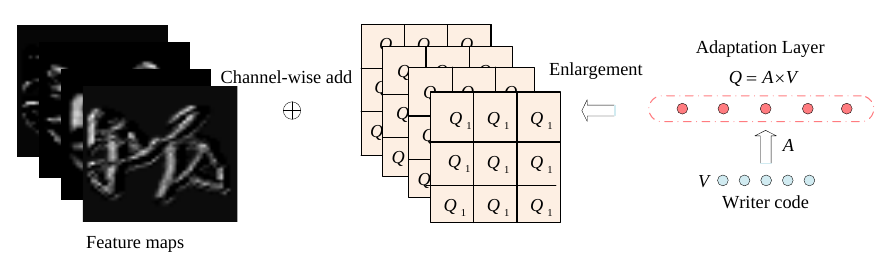
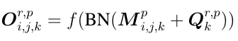

# wang2020

Implementation of CNN adaptation method used in "Writer-Aware CNN for Parsimonious
HMM-Based Offline Handwritten Chinese Text Recognition" by Wang et al. (2020). It is
encapsulated in this image:



Basically the writer code is converted to a channel-wise bias vector by a linear
transformation. The layer output is then of the following form:



where M is the regular convolution layer output, and Q is the channel-wise bias
vector derived from the writer code. Note that f is a activation function (ReLU).

The most promising setup I tried thus far is obtained by freezing the decoder weights,
and jointly training/finetuning the new layers and ResNet layers. The batchnorm stats
were not frozen in this run. However, this setup did not seem to outperform the base
model.

# Master thesis

## How to install
```shell
git@github.com:tobiasvanderwerff/master-thesis.git  # uses SSH
cd master-thesis
git submodule update --init
pip install -e htr
pip install -e .
```

## Points of attention
- 16-bit mixed precision cannot be used right now in combination with the
  `learn2learn` lib. This is because the `learn2learn` lib calls backpropagation
  for you when calling the inner loop adaptation function. This means the Pytorch
  Lightning cannot scale the gradients etc. accordingly when doing backpropagation.
