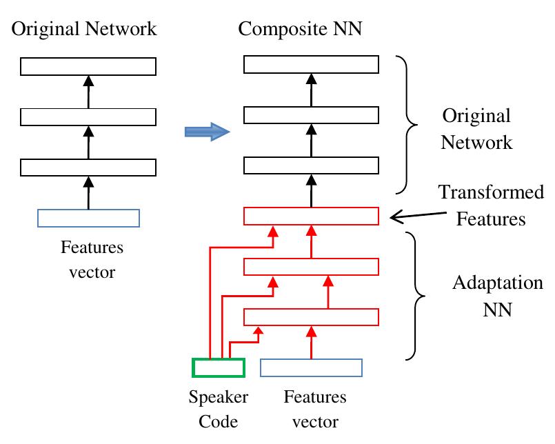

# Writer codes

## Short description
Writer codes for writer adaptation

## Long description

Training is initialized with a trained base model. During training, a newly
initalized adaptation network is trained, along with a set of writer embeddings. The
writer embeddings (codes) are used to adapt the feature map output from the CNN
image encoder to a specific writer.

This is roughly the idea (Abdel-Hamid et al., 2013) [1]:

The way the embeddings are created and the adaptation performed can be done in
several ways. Currently implemented strategies are

**Strategy 1**: implementation of Abdel-Hamid et al., i.e.  train a set of embeddings
and an adaptation network. The embeddings are concatenated to each intermediate feature map of the adaptation
network, as shown in the figure above. During inference, a new embedding is created by
performing one or multiple gradient steps on a randomly initialized embedding, using an adaptation batch.

**Strategy 2**: Transform the incoming features to create an initial embedding.

## Implementation details
New flags:
    - embedding size
    - how to include embeddings

Possible setups:
- Freeze original model and add adaptation layers with writer codes, as used in "Fast
  speaker adaptation of hybrid NN/HMM model for speech recognition based on
  discriminative learning of speaker code" (2013). Note that this may not work well for
  CNNs; see the follow-up paper "Rapid and Effective Speaker Adaptation of Convolutional
  Neural Network Based Models for Speech Recognition" by the same authors. Perhaps place
  the adaptation layers after the CNN output.
- Same as above, but also finetune the original model (i.e. do not freeze the base model
  weights)

### Ways to add embeddings
- concatenate embedding to features (eq. 23)
- add embedding to features (eq. 24)
- affine transform of the features to obtain embedding (eq. 25)

For all options above, also try training where sometimes the writer is not given as input, e.g. the null vector. Does this still lead to good performance?

Note: in IAM, writers for training are disjoint with writers for validation. So the
embeddings should be trained based on a handful of examples for a writer.
	- idea: start with the closest matching embedding and adapt from there

### How to extract embeddings
- simple backprop to embedding layer (implies potentialy restricted writer set)
- bottleneck layer
- multi-task learning. what auxiliary loss function? Writer classification?
	- triplet loss?

Two options for most setups:
- start with trained model, freeze it and train newly added weights (most attractive)
	- bonus: model still works without embeddings
- train from scratch
	- potentially better performance

## Motivation

## References
[1] Abdel-Hamid, Ossama, and Hui Jiang. "Fast speaker adaptation of hybrid NN/HMM model for speech recognition based on discriminative learning of speaker code." 2013 IEEE International Conference on Acoustics, Speech and Signal Processing. IEEE, 2013.
